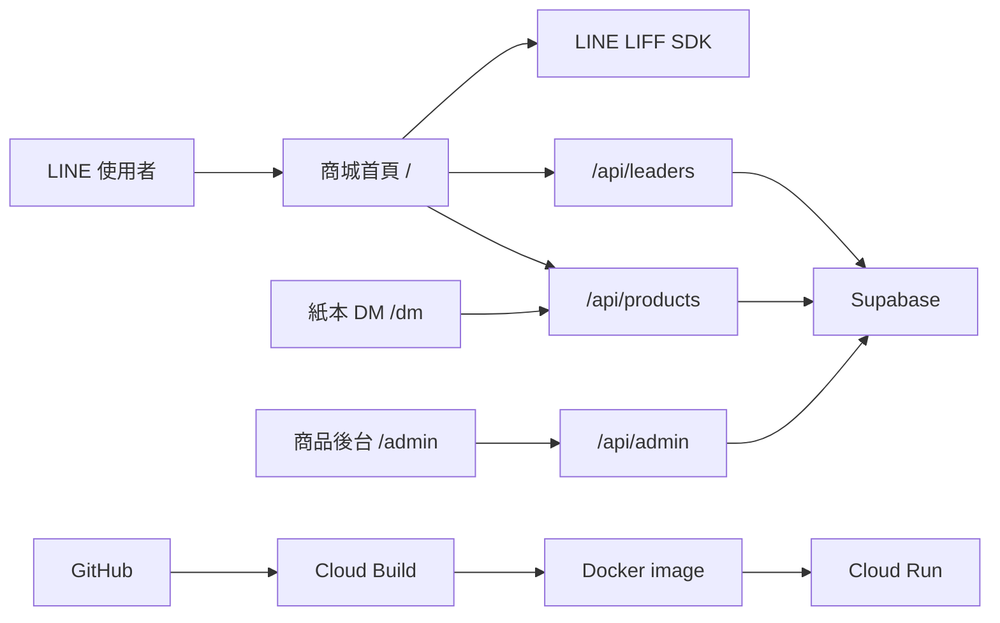

# 專案架構

## 1. 系統定位

這是一套以 LINE LIFF 為入口的團購商城。一般使用者選擇團購主後，可以瀏覽
商品、登記數量與分享商品。團購主可以決定販售商品、查看與移除登記、分享
圖卡、產生紙本 DM，並透過隱藏入口進入 PIN 保護的商品後台。

它不是純前端網站：Next.js 同時承擔頁面、API 和伺服器端 Supabase 存取，
正式環境以 Docker 容器部署在 Google Cloud Run。



## 2. 技術堆疊

- Next.js 15 App Router
- React 19、TypeScript
- Tailwind CSS 4
- shadcn/ui、Radix UI、Lucide icons
- Supabase JavaScript SDK
- LINE LIFF SDK
- Docker、Google Cloud Build、Google Cloud Run

Next.js 設定為 `standalone` 輸出，適合複製進精簡的正式 Docker image。
目前設定會在建置時略過 TypeScript 與 ESLint 錯誤。

## 3. 目錄

```text
app/                         Next.js 頁面、版型與 API
  page.tsx                   商城核心頁面
  layout.tsx                 全站 metadata、LIFF SDK、通知元件
  admin/page.tsx             商品管理後台
  dm/page.tsx                可列印商品型錄
  intro/page.tsx             操作導引 iframe
  api/products/route.ts      商城讀寫 API
  api/leaders/route.ts       團主查詢 API
  api/admin/route.ts         商品管理 API
components/
  group-buy/                 商城、商品卡與團主管理元件
  admin/                     商品表單與批次貼上元件
  ui/                        shadcn/Radix 基礎 UI
lib/                         Supabase client 與通用工具
hooks/                       共用 React hooks
public/                      圖片與已編譯的操作導引
db_scripts/                  GroupLeaders 建表與種子資料
中油團購主系統操作導引/      獨立的 Vite/React 操作手冊原始碼
Dockerfile                   正式容器
cloudbuild.yaml              Cloud Build 與 Cloud Run 部署
```

根目錄另有多個資料庫檢查、重複資料檢查和修復腳本。它們是維護工具，不是
網站執行時流程的一部分；執行會寫入資料的修復腳本前，必須先確認目標環境與
影響範圍。

## 4. 路由

| 路由 | 類型 | 功能 |
|---|---|---|
| `/` | Client page | LIFF 初始化、團主選擇、商品與登記主流程 |
| `/admin` | Client page | PIN 登入、商品 CRUD、批次匯入 |
| `/dm` | Client page | 依 `leaderId` 載入集單商品並產生列印版 |
| `/intro` | Server page | iframe 顯示操作導引靜態網站 |
| `/api/products` | Dynamic API | 商品讀取、登記、啟用商品、團主綁定與解除 |
| `/api/leaders` | Dynamic API | 團主列表與 LINE 綁定狀態查詢 |
| `/api/admin` | API | PIN 保護的商品管理操作 |

新增一般頁面的標準位置是 `app/<route>/page.tsx`。如果頁面需要出現在現有
商城導覽中，還要在對應的 header、tab 或團主管理元件加入入口。

## 5. 商城首頁流程

`app/page.tsx` 是主要 orchestration layer，負責：

1. 載入 LIFF SDK 並初始化 LIFF ID。
2. 從網址、`liff.state`、session storage 或 local storage 保留
   `leaderId`。
3. 取得 LINE profile；必要時退回 context ID 或訪客 session。
4. 查詢 `Members` 補充會員資料。
5. 沒有團主時顯示 `LeaderSelector`。
6. 呼叫 `/api/products` 載入商品、團主、登記與啟用狀態。
7. 產生熱銷、許願與團主管理三個頁籤。
8. 處理數量、登記送出、取消登記、啟用商品與 LINE 分享。

主要畫面元件：

- `LeaderSelector`：團主搜尋、GPS 距離計算、LINE 綁定入口
- `StoriesBar`：熱門商品快速定位
- `IGProductFeed`：商品列表
- `IGFeedCard`：單一商品互動卡片
- `StickyTabs`：底部頁籤
- `LeaderManagementTab`：分享、名單、DM、解除團主、後台入口
- `OrderSummaryDrawer`：團主登記統計

首頁目前超過一千行。新功能應優先抽成 hook、helper、component 或 service，
避免繼續把所有責任加入首頁。

## 6. LIFF 身分與授權

瀏覽器端使用 LIFF 取得 profile、context 與 ID token。需要寫入資料的動作會把
ID token 送到 API；API 透過 LINE token verification endpoint 驗證，再比對
傳入的使用者 ID。

團主身分來自 `GroupLeaders.LineID` 與 LINE user ID 的綁定。綁定時使用站號
與工號組成的 `Username` 尋找團主，並寫入 LINE ID、頭像與顯示名稱。

開發模式目前會放寬部分團主畫面的判斷，方便本機操作。這只是開發便利措施，
不能用來證明正式環境授權正確。

團主管理頁的後台入口需要連點五次才出現，但隱藏入口不是安全機制；真正的
後台保護是 `/api/admin` 對 `ADMIN_PIN` 的伺服器端比對。

## 7. Supabase 資料模型

### `products`

商品主檔。重要欄位包含：

- `WaveID`
- `商品名稱`
- `原價`、`團購價`
- `MOQ`
- `圖片網址`、`商城連結`、`商品描述`
- `選品開始時間`、`選品結束時間`
- `販售開始時間`、`販售結束時間`

### `GroupLeaders`

團主主檔。包含 `Username`、團主名稱、暱稱、加油站、站代號、地址、經緯度、
LINE ID 與頭像。`Username` 是商城使用的 `leaderId`。

### `intentdb`

使用者登記紀錄。主要包含團主 ID、團員 ID、團員暱稱、商品名稱、數量、波段
與頭像。API 會依商品名稱彙總數量和登記人列表。

### `leaderbinding`

記錄每位團主在每個波段啟用的商品名稱清單。

### `Members`

LINE 會員補充資料，由首頁直接查詢。瀏覽器端是否能安全讀取取決於正式環境的
RLS 和 grants。

## 8. 商品階段

`/api/products` 依目前時間判斷：

- `collecting`：位於選品開始與選品結束之間
- `active`：選品結束後、販售結束前
- `closed`：其他時間，不回傳至前台

四個日期都空白時會視為 `collecting`。API 以台北時區格式化顯示日期，並針對
午夜做特殊顯示處理。

## 9. API 責任

### `GET /api/products`

平行取得商品、指定團主的登記與商品綁定，接著：

1. 將商品依 wave 和 phase 分組。
2. 查詢團主名稱、頭像、站點與身分。
3. 彙總商品登記數量、團員與頭像。
4. 標記團主是否啟用商品。
5. 回傳前端需要的 `activeWaves`。

### `POST /api/products`

以 `action` 分派：

- `submit_batch_intent`
- `enable_product`
- `bind_leader`
- `unbind_leader`

### `/api/leaders`

- 預設回傳有效團主
- `action=check_status` 查詢某 LINE 使用者是否已綁定團主

### `/api/admin`

每次操作都要帶 PIN。支援登入驗證、列表、新增、修改、刪除、replace 與
批次新增。

## 10. 商品後台

`/admin` 不使用獨立帳號系統，而是要求輸入 `ADMIN_PIN`。前端 PIN 只存在當次
頁面狀態，所有資料操作都再次送到 `/api/admin` 驗證。

後台包含：

- 商品列表
- 新增與編輯表單
- 刪除
- 批次貼上、預覽與匯入
- 商品名稱重複檢查

## 11. 紙本 DM

`/dm?leaderId=...` 呼叫 `/api/products`，只顯示集單或準備中的商品。頁面提供：

- 團主名稱與商城 QR code
- 商品圖片、價格與期間
- 複製連結
- Email 連結
- 專用 print CSS

QR code 目前由外部 QR code API 產生，因此列印時仍依賴外部服務可用。

## 12. 操作導引子專案

`中油團購主系統操作導引/` 是獨立 Vite/React 專案。正式網站不直接執行它的
開發伺服器，而是使用已建置並放在 `public/intro-content/` 的靜態檔案。

正確修改流程：

1. 在子專案 `src/` 修改內容。
2. 安裝子專案相依套件。
3. 執行子專案 build。
4. 將 build 產物同步到 `public/intro-content/`。
5. 從主專案驗證 `/intro` 和所有圖片、GIF、PDF 路徑。

## 13. 部署

`cloudbuild.yaml` 使用 Kaniko 建立 image，再由 `gcloud run deploy` 部署到
`asia-east1`。`Dockerfile` 使用 multi-stage build：

1. 安裝相依套件。
2. 執行 Next.js build。
3. 複製 standalone server、static 和 public。
4. 以非 root 的 `nextjs` 使用者執行 `server.js`。

公開環境變數可以在 image build 階段注入；service role key、管理 PIN 等秘密
應只存在 Cloud Run runtime secrets/environment，不應寫進 image 或 Git。

## 14. 已知技術債

- `app/page.tsx` 和 `app/api/products/route.ts` 過大。
- Product、Voter 等介面在多個檔案重複定義。
- 部分舊商品卡、進度面板和 `SeedMode` 沒有被現行主流程使用。
- `next.config.mjs` 跳過 TypeScript 與 lint 錯誤。
- 根目錄 lint script 缺少 ESLint dependency。
- 目前沒有正式的自動化測試。
- 主專案與操作導引子專案放在同一個 TypeScript include 範圍，讓型別檢查混入
  兩套相依環境。
- 根目錄存在許多一次性診斷檔、build log、匯出設定和舊結果檔。

## 15. 安全待辦

歷史追蹤的診斷與部署匯出檔可能包含 Supabase service secret、JWT 形式的 key
或其他環境值。不要在文件、issue、log 或聊天中貼出值本身。

建議以獨立安全工作完成：

1. 立即旋轉可能已暴露的 service role key 與管理憑證。
2. 將秘密改放到 Cloud Run Secret Manager 或安全的 runtime environment。
3. 從目前 Git tree 和 Git history 移除秘密。
4. 加入 secret scanning。
5. 檢查正式 Supabase RLS 與 grants。

`db_scripts/create_group_leaders.sql` 中名為只更新 LineID 的 public update policy，
其 policy expression 本身沒有欄位限制。實際風險仍取決於資料庫 grants，但正式
環境必須重新確認，不能只依賴 policy 名稱或註解。

## 16. 建議演進方向

優先順序：

1. 旋轉並移除已追蹤的秘密。
2. 恢復可靠的 TypeScript、ESLint 和測試檢查。
3. 將共用 domain types 搬到 `types/` 或 `lib/domain/`。
4. 拆分 LIFF initialization、product API client、sharing 和 cart hooks。
5. 將 API 的資料 mapping、authorization 和 action handler 拆開。
6. 清除已確認不用的元件、log、匯出檔和一次性腳本。

